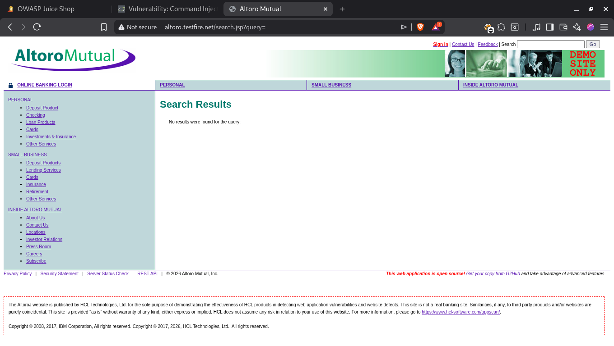

# InjectSuite - Documentation

InjectSuite is a modular security toolkit designed to help security researchers identify injection vulnerabilities in web applications. This documentation provides an in-depth look at its architecture and how each scanning module operates.

---

## 🏗 Project Architecture

InjectSuite is built with a modular structure that allows for easy extension and maintenance.


```text
/home/cybertron/PROJECTS/CODEX/injectsuite_CLI /
├── injectsuite.py                 # Main entry point and orchestration layer
├── requirements.txt        # Project dependencies
├── screenshots/            # Directory for screenshots
├── scanners/               # Scanning modules directory
│   ├── __init__.py         # Module initializer
│   ├── cmdi_scanner.py     # OS Command Injection scanner
│   ├── sqli_scanner.py     # SQL Injection scanner
│   └── xss_scanner.py      # Cross-Site Scripting (XSS) scanner
├── README.md               # Project overview
└── DOCUMENTATION.md        # Technical documentation (this file)
```

---

## 🛡 Scanning Modules

### 1. SQL Injection (SQLi) Scanner (`scanners/sqli_scanner.py`)
- **Detection Methods**: Boolean-Based, Time-Based, Redirect-Based, Keyword-Based.
- **Validation**: Tested against **Altoro Mutual (TestFire)** and **DVWA**.



### 2. XSS (Reflected) Scanner (`scanners/xss_scanner.py`)
- **Detection Method**: Payload reflection testing.
- **Validation**: Verified with modern application frameworks like **Juice Shop**.


### 3. Command Injection (CMDi) Scanner (`scanners/cmdi_scanner.py`)
- **Detection Method**: OS command execution indicator detection.
- **Validation**: Proved effective in legacy and modern environments.


---

## 🧪 Security Testing & Validation

The toolkit was rigorously tested using **Docker-based** local environments to ensure behavioral accuracy.

### 🏠 Local Testing Environment Setup

To recreate the testing environment, follow these Docker commands:

| Platform | Docker Command | Purpose |
| :--- | :--- | :--- |
| **Juice Shop** | `docker run --rm -p 3000:3000 bkimminich/juice-shop` | Testing modern XSS & API injection. |
| **DVWA** | `docker run --rm -p 80:80 vulnerables/web-dvwa` | Testing classic SQLi & Command Injection. |

### 📸 Testing Screenshots


---

## 🔧 Core Components

### `injectsuite.py`
The orchestration layer of InjectSuite. It manages the CLI interface using the `rich` library, providing a high-quality user experience with:
- **Matrix-Style Boot Sequence**: Visual feedback during initial startup.
- **Dynamic Module Loading**: Scanners are imported only when needed, keeping the initial footprint small.
- **Interactive Menu**: A simple navigation system to switch between scanners.


---

## 🔒 Security & Privacy Notice

- **Safe Handling**: InjectSuite does not store any sensitive data like user credentials or session tokens.
- **Transparency**: All requests made by the tool are visible through the CLI output.
- **Permission Mandatory**: This tool must **only** be used on systems where you have **explicit, written authorization**. Testing without permission is illegal and unethical.

---

*This project was created for educational purposes to demonstrate the power of Python in the field of cybersecurity.*
